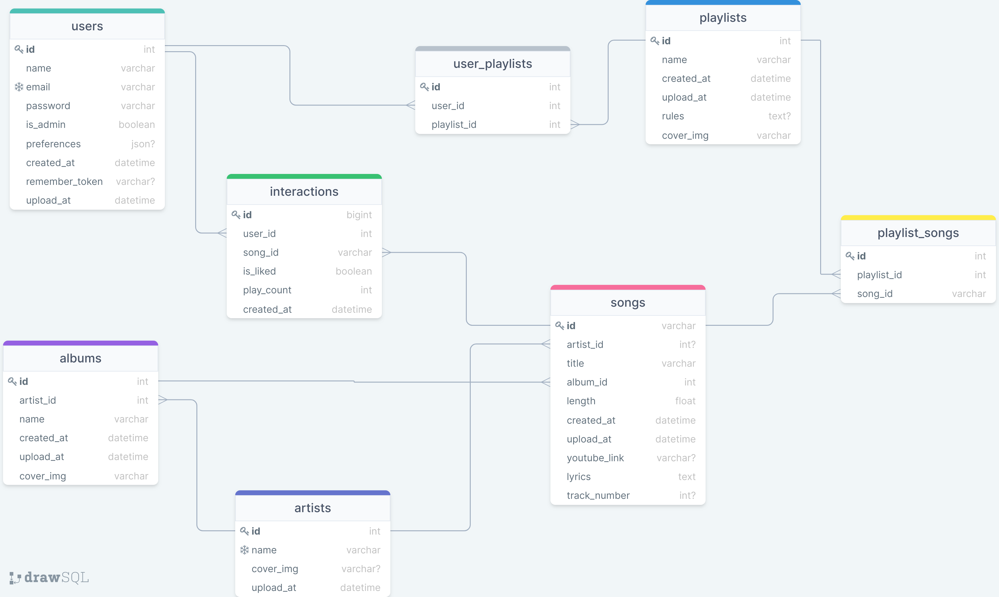

# SHTRUDEL MUSIC

## SERVER
- Server work with mysql and express.
- Authentication with jwt, joi and bcrypt.
- Entry Point with my sql queries.
- ORM branch - same server with sequelize and express, without conecting to client.

## CLIENT
- Register and Login user page.
- Home page with top songs, albums, artists and playlists.
- Option to search for song, album, artist and playlist.  
- Artist page with artist songs and albums.
- Album page with album songs.
- Playlist page with playlist songs.
- Song page- play the song, on the side, song details and song list that depends on the page that you came from.
- Option to add artists, albums and songs.
- Statistic with google-statistics and mixpanel.

## app gif

## Entity Relationship Diagram

 
 ## Getting Started

Clone this repo.   
- Setup server  
    1. `cd server`  
    2. `npm i` 
    3. Match the createConnection to your machine.
    4. copy shtrudel_music.sql file to your mySql UI and run it
    5. `node .`
- Setup client  
    1. `cd client`  
    2. `npm i` 
    3. `npm start`- for development